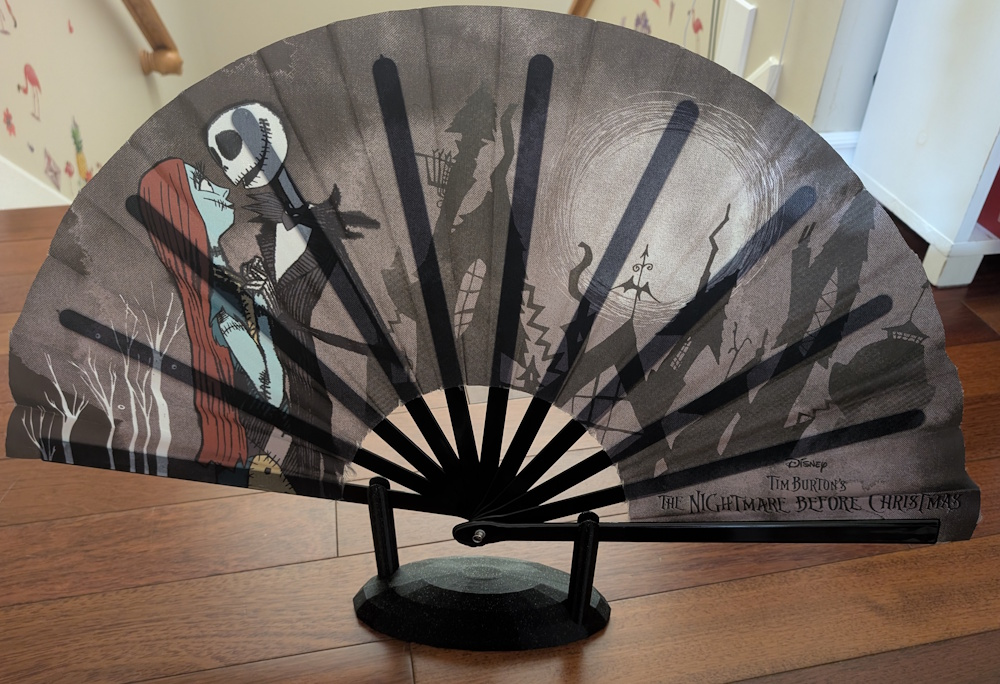
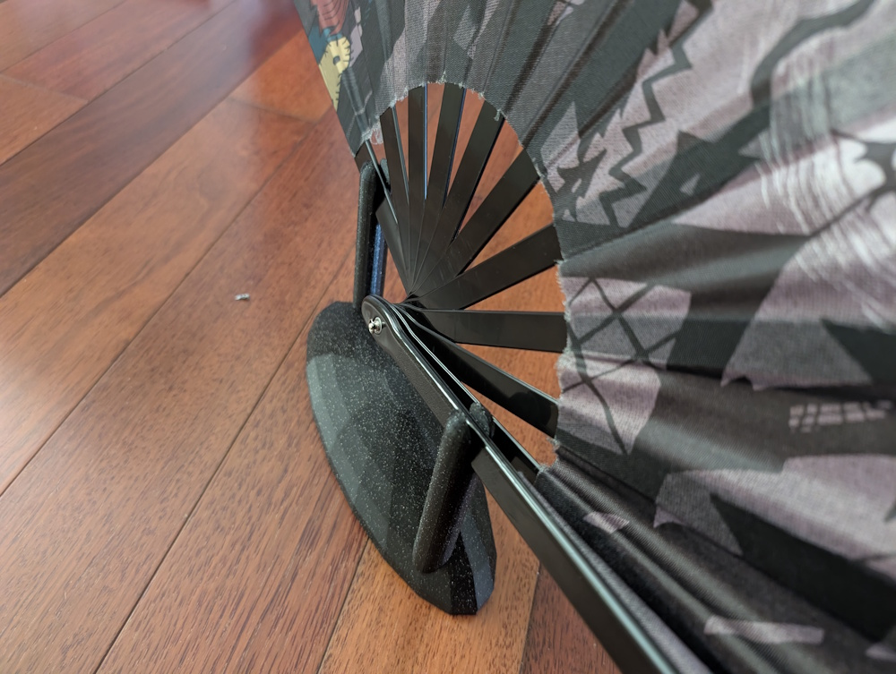
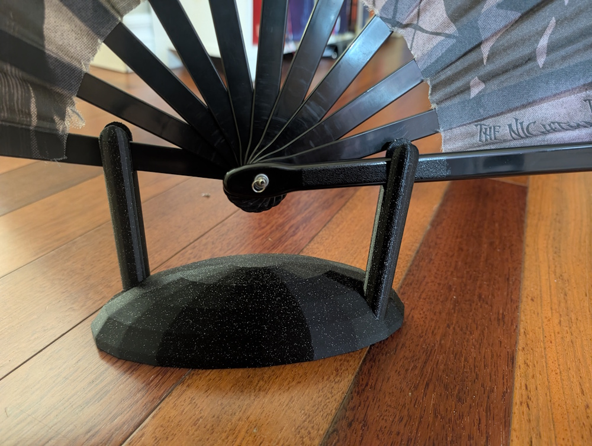
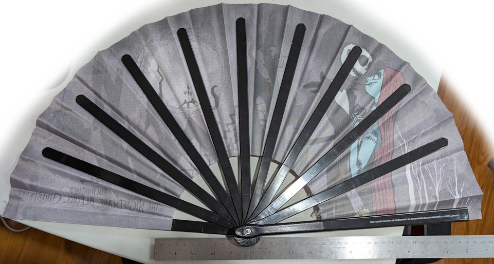
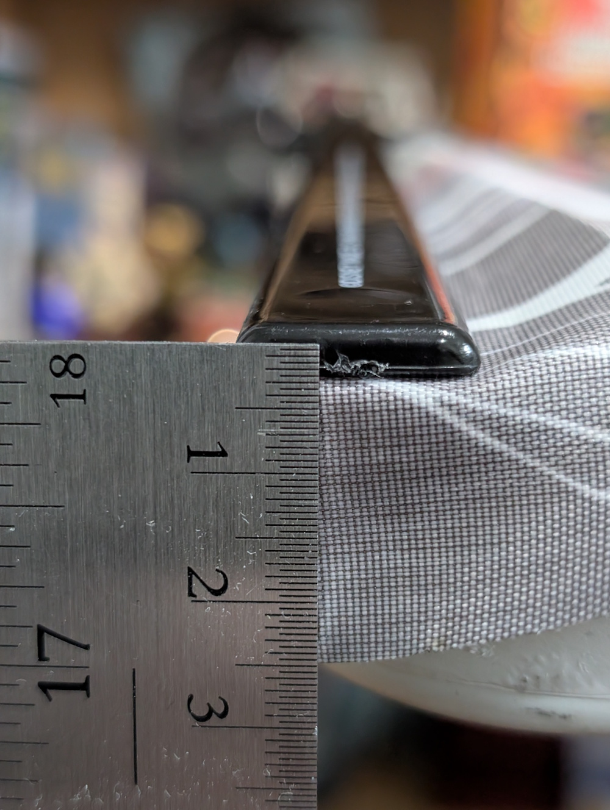
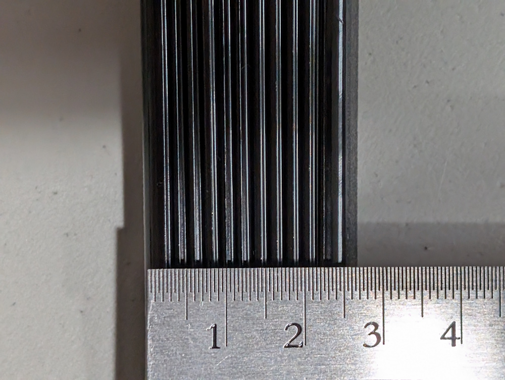

# About

An OpenSCAD script to create a parametric stand structure for mounting a fan. The design features a half oval (half ellipse) shape that provides stable structural support.

# Final Result

# Design Parameters

The fan stand can be customized using the following parameters:

## Base Width (X)

Controls the width of the base support structure.

## Fan Blade Width

Adjusts the spacing to accommodate different fan blade sizes.

## Fan Spread

Determines the overall spread and mounting configuration.

# The Files

- `fan-stand.scad` - The OpenSCAD source file with customizable parameters
- `fan-stand.stl` - The exported STL model ready for 3D printing

# Printing Recommendations

For a more solid and sturdy stand, use a higher infill percentage such as 70%. This will make the stand feel more massive and provide better structural support for the fan.

# Customization

Open `fan-stand.scad` in OpenSCAD and adjust the parameters at the top of the file to customize the dimensions for your specific fan mounting needs. The parametric design allows for easy modification of base width, height, and other dimensions to fit various fan sizes.
