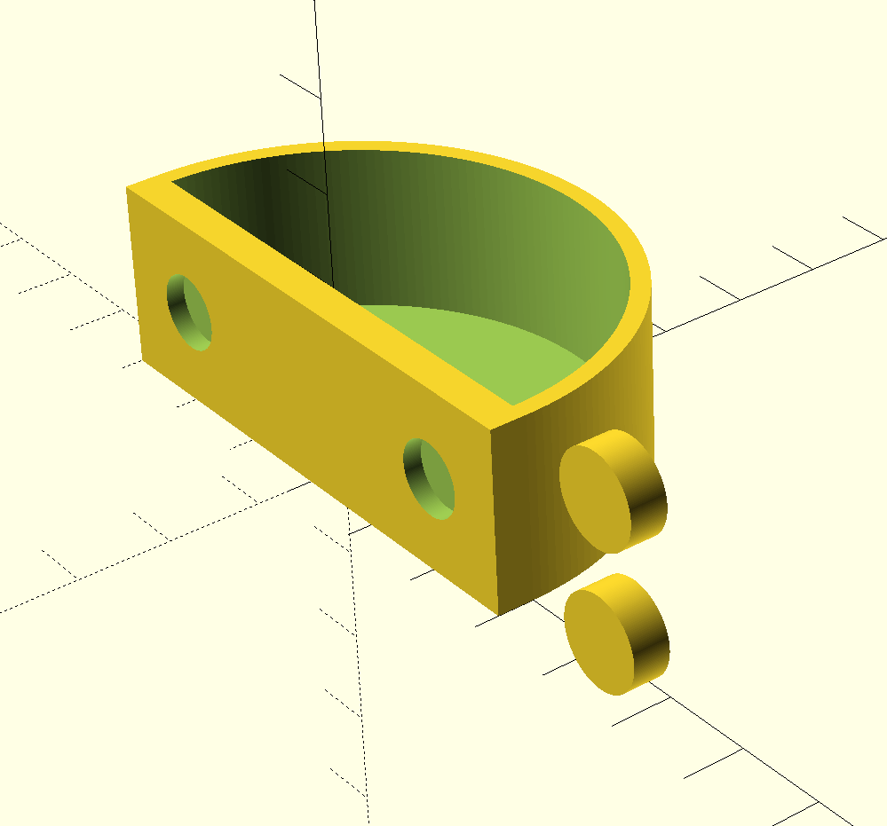
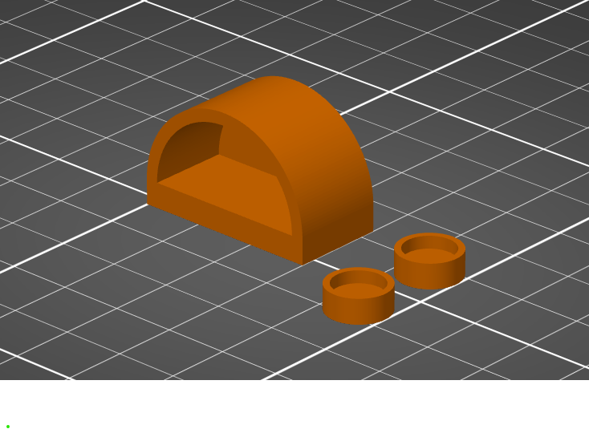

# About

A 3D-printed bowl (half-cylinder) designed for jumping spider terrariums. This model features magnetic attachment points that allow the bowl to be securely mounted to glass surfaces, making it easy to install and reposition within the terrarium. Perfect for holding water, food, or substrate.

# The Model

# Design Features

The bowl is designed with the following specifications:
- **30mm outer diameter** - appropriately sized for small jumping spiders
- **15mm height** - shallow enough for easy spider access
- **2mm wall thickness** - lightweight yet sturdy
- **Half-cylinder shape** - flat back mounts flush against terrarium glass

## Magnetic Attachment System

The design includes integrated magnet housings:
- **8mm diameter magnets**
- **2mm depth** magnet slots
- **2mm margin** - additional diameter and depth for secure housing
- Two magnet housings built into the back panel
- Two additional detachable magnet housings for the glass side
- The magnets allow the bowl to attach securely to glass terrarium walls

## Customization

You can modify the OpenSCAD file to adjust:
- Bowl diameter (`bowlDiameter`)
- Wall thickness (`thickness`)
- Bowl height (`height`)
- Resolution (`resolution` - number of facets for cylinders)
- Magnet dimensions (`magnetDiameter`, `magnetDepth`, `magnetMargin`)

# The Files

- `jumping-spider-terrarium-bowl.scad` - The OpenSCAD source file with customizable parameters
- `jumping-spider-terrarium-bowl.stl` - The exported STL model ready for 3D printing
- `jumping-spider-terrarium-bowl.3mf` - The 3MF model with slicer settings

# Slicer Setup

# Installation Instructions

1. Print the main bowl and the two detached magnet housings
2. Insert 8mm diameter x 2mm thick neodymium magnets into all four magnet housings (two in the bowl's back panel, two detached)
3. Position the detached magnet housings on the outside of the terrarium glass where you want to mount the bowl
4. Place the bowl on the inside of the glass, aligning with the external magnets
