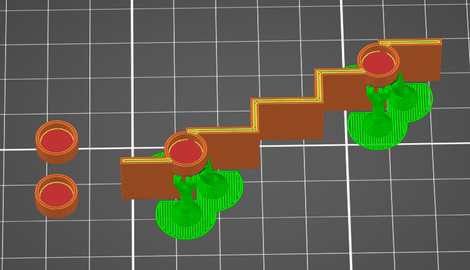
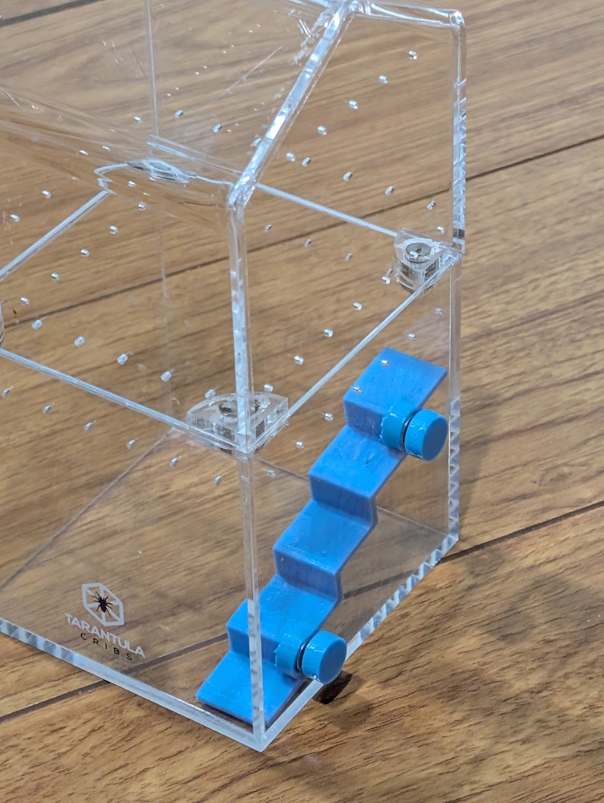
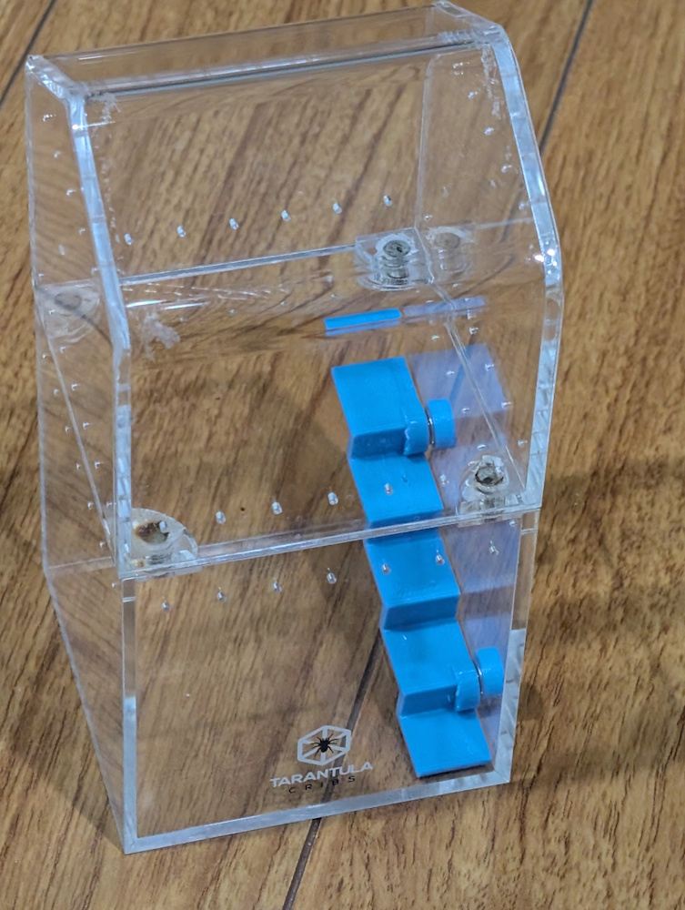

# About

A 3D-printed staircase designed for jumping spider terrariums. This model features magnetic attachment points that allow the stairs to be securely mounted to glass surfaces, making it easy to install and reposition within the terrarium.

# The Model

# Design Features

The stairs are designed with the following specifications:
- **5 steps** with a gradual incline
- **8mm step height** - comfortable for small jumping spiders
- **15mm step depth** - provides adequate footing
- **15mm width** - allows safe passage
- **2mm thickness** - lightweight yet sturdy

## Magnetic Attachment System

The design includes integrated magnet housings:
- **7mm diameter magnets**
- **2mm depth** magnet slots
- Two magnet housings built into the staircase structure
- Two additional detachable magnet housings for the glass side
- The magnets allow the stairs to attach securely to glass terrarium walls

# The Files

- `jumping-spider-terrarium-stairs.scad` - The OpenSCAD source file with customizable parameters
- `jumping-spider-terrarium-stairs.stl` - The exported STL model ready for 3D printing

# Slicer Setup

# Installation Instructions

1. Print the main staircase and the two detached magnet housings
    - Put on the side as on the last picture.
    - Add support (can be of `organic` type)
2. Insert 7mm diameter x 2mm thick neodymium magnets into all four magnet housings (two in the staircase, two detached)
3. Position the detached magnet housings on the outside of the terrarium glass where you want to mount the stairs
4. Place the staircase on the inside of the glass, aligning with the external magnets

# In Action

# Customization

You can modify the OpenSCAD file to adjust:
- Number of steps (`numSteps`)
- Step height (`stepHeight`)
- Step width (`width`)
- Step depth (`stepDepth`)
- Step thickness (`stepThickness`)
- Magnet dimensions (`magnetDiameter`, `magnetDepth`)
