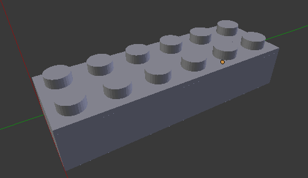
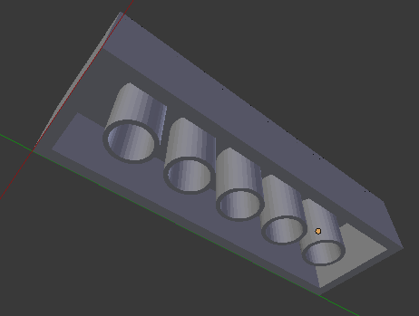
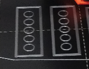
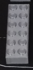
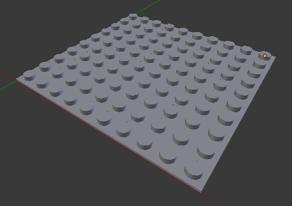
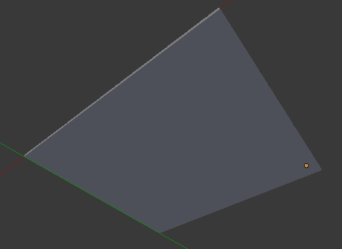

# About

Scripts for creating LEGO-compatible bricks with customizable top pins and bottom entries.

Available in two formats:
- **Python script** (`create_brick.py`) for Blender 3D
- **OpenSCAD script** (`create_brick.scad`) for OpenSCAD

# Usage

## Blender (Python)

1. Open Blender 3D
2. Open the Scripting workspace
3. Load `create_brick.py`
4. Edit the options at the top of the file
5. Run the script

## OpenSCAD

1. Open OpenSCAD
2. Open `create_brick.scad`
3. Edit the options at the top of the file
4. Press F5 to preview or F6 to render
5. Export as STL for 3D printing

## Options

Both scripts use the same variables:
- `pinCount`: Array [width, length] - How many top pins in each dimension
- `entryZ`: Height of the block - 2mm for plates or 8.2mm for normal brick size
- `printTopPins`: Set to `true` to add pins on top of the brick
- `printBottomEntries`: Set to `true` to add hollow entries underneath for connecting other bricks

# Examples

## 2x6 brick (top and bottom)

**Blender (Python):**
```python
pinCount = [2, 6]
entryZ = 8.2

printTopPins = True
printBottomEntries = True
```

**OpenSCAD:**
```openscad
pinCount = [2, 6];
entryZ = 8.2;

printTopPins = true;
printBottomEntries = true;
```






## 10x10 plate (only top)

**Blender (Python):**
```python
pinCount = [10, 10]
entryZ = 2

printTopPins = True
printBottomEntries = False
```

**OpenSCAD:**
```openscad
pinCount = [10, 10];
entryZ = 2;

printTopPins = true;
printBottomEntries = false;
```



