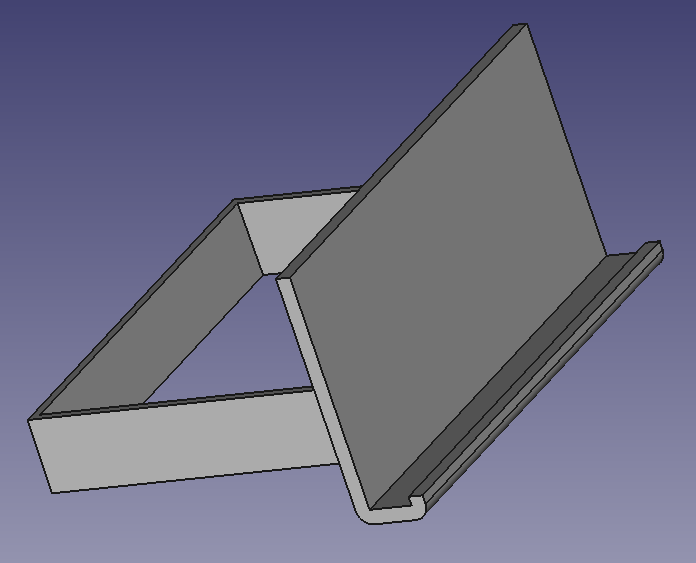
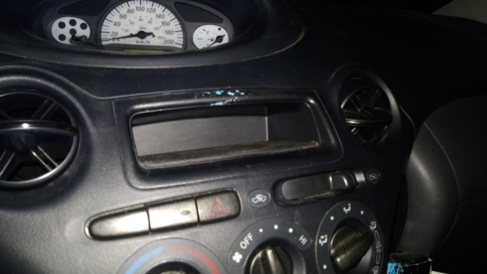
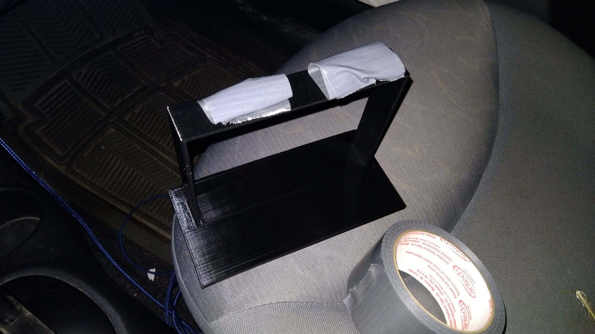
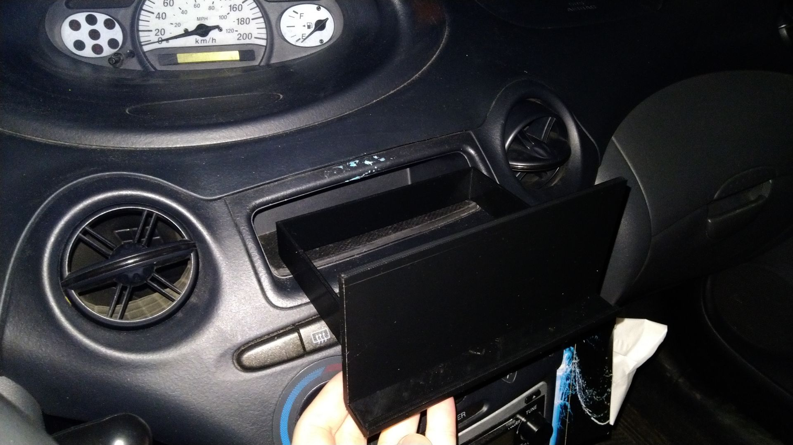
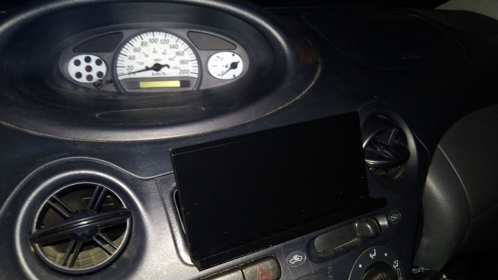

# About

A FreeCAD model of a cell support to place over the radio in a Toyota Echo 2005 car.

# The model

# The files

- toyota_echo_2005-cell_support.FCStd : The FreeCAD file
- toyota_echo_2005-cell_support.stl : The exported model that you can use to print the part

# Instructions

1. Spot the location in the car

1. Put some duct tape on the back of the part and also on the sides to stabilize

1. Insert it and make sure you push the sides for the duct tape to stick

1. Enjoy

